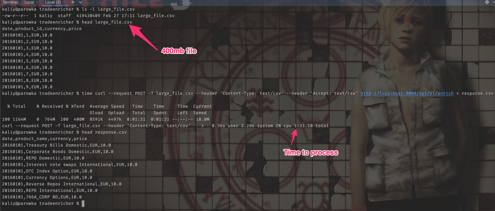

# Service description
The service exposes 1 endpoint - `/api/v1/enrich`

It accepts a csv file with the following format:
```
date,product_id,currency,price
20160101,1,EUR,10.0
20160101,2,EUR,20.1
20160101,3,EUR,30.34
```
and gives a response with following format:
```
date,product_name,currency,price
20160101,Treasury Bills Domestic,EUR,10.0
20160101,Corporate Bonds Domestic,EUR,20.1
20160101,REPO Domestic,EUR,30.34
```

To run this service it's enough to just execute `./gradlew bootRun` in the root directory of the project:

```
kaliy@parowka tradeenricher % ./gradlew bootRun

> Task :bootRun
Standard Commons Logging discovery in action with spring-jcl: please remove commons-logging.jar from classpath in order to avoid potential conflicts

  .   ____          _            __ _ _
 /\\ / ___'_ __ _ _(_)_ __  __ _ \ \ \ \
( ( )\___ | '_ | '_| | '_ \/ _` | \ \ \ \
 \\/  ___)| |_)| | | | | || (_| |  ) ) ) )
  '  |____| .__|_| |_|_| |_\__, | / / / /
 =========|_|==============|___/=/_/_/_/
 :: Spring Boot ::                (v3.2.3)

2024-02-27T17:21:35.454+01:00  INFO 31641 --- [           main] o.kaliy.trade.TradeEnricherApplication   : Starting TradeEnricherApplication using Java 17.0.8.1 with PID 31641 (/Users/kaliy/projects/sandbox/tradeenricher/build/classes/java/main started by kaliy in /Users/kaliy/projects/sandbox/tradeenricher)
2024-02-27T17:21:35.456+01:00  INFO 31641 --- [           main] o.kaliy.trade.TradeEnricherApplication   : No active profile set, falling back to 1 default profile: "default"
2024-02-27T17:21:35.723+01:00  INFO 31641 --- [           main] o.s.b.w.embedded.tomcat.TomcatWebServer  : Tomcat initialized with port 8080 (http)
2024-02-27T17:21:35.729+01:00  INFO 31641 --- [           main] o.apache.catalina.core.StandardService   : Starting service [Tomcat]
2024-02-27T17:21:35.729+01:00  INFO 31641 --- [           main] o.apache.catalina.core.StandardEngine    : Starting Servlet engine: [Apache Tomcat/10.1.19]
2024-02-27T17:21:35.748+01:00  INFO 31641 --- [           main] o.a.c.c.C.[Tomcat].[localhost].[/]       : Initializing Spring embedded WebApplicationContext
2024-02-27T17:21:35.748+01:00  INFO 31641 --- [           main] w.s.c.ServletWebServerApplicationContext : Root WebApplicationContext: initialization completed in 278 ms
Standard Commons Logging discovery in action with spring-jcl: please remove commons-logging.jar from classpath in order to avoid potential conflicts
2024-02-27T17:21:35.822+01:00 DEBUG 31641 --- [           main] s.w.s.m.m.a.RequestMappingHandlerMapping : 3 mappings in 'requestMappingHandlerMapping'
2024-02-27T17:21:35.839+01:00 DEBUG 31641 --- [           main] o.s.w.s.handler.SimpleUrlHandlerMapping  : Patterns [/webjars/**, /**] in 'resourceHandlerMapping'
2024-02-27T17:21:35.845+01:00 DEBUG 31641 --- [           main] s.w.s.m.m.a.RequestMappingHandlerAdapter : ControllerAdvice beans: 0 @ModelAttribute, 0 @InitBinder, 1 RequestBodyAdvice, 1 ResponseBodyAdvice
2024-02-27T17:21:35.854+01:00 DEBUG 31641 --- [           main] .m.m.a.ExceptionHandlerExceptionResolver : ControllerAdvice beans: 0 @ExceptionHandler, 1 ResponseBodyAdvice
2024-02-27T17:21:35.874+01:00  INFO 31641 --- [           main] o.s.b.w.embedded.tomcat.TomcatWebServer  : Tomcat started on port 8080 (http) with context path ''
2024-02-27T17:21:35.878+01:00  INFO 31641 --- [           main] o.kaliy.trade.TradeEnricherApplication   : Started TradeEnricherApplication in 0.542 seconds (process running for 0.649)
```

# Assumptions
1. Extensibility is a concern
2. Big files should be supported
3. Fields order matters
4. product.csv is a static file that fits into memory

Additionally, I assume that there is an error in the original requirement: for the input `20160101,1,EUR,10.0` there is an
expected response `20160101,Treasury Bills Domestic,EUR,10` which changes `10.0` to `10`.

### Extensibility
The service is designed to be easily extensible.

To add new field enricher it's enough to create a new class implementing `FieldProvider` interface.

The package structure is done with package-per-feature in mind (almost all of the classes have package-private visibility).

### Big files

The service is designed to be able to handle big files. It uses Streams to process the input request and the same 
Writer for the output. It minimizes the memory requirement to consume the InputStream from the request.

#### Load testing

I performed a simple load test with 400mb file. The service was able to handle it. The memory consumption was stable:



### Fields order

Although the fields order is not explicitly mentioned icn the requirements, I assume that it matters. That's why 
FieldProviders are ordered using Spring `@Order` annotation.

### product.csv

This is a static file. I assume that it fits into memory. If it's not the case, it's possible to use a database or 
caching layer (like Redis) to store the data. To do that, it's enough to switch the implementation of the 
`ProductNameResolver` interface.

# Further improvements

1. It's possible to use the webflux to handle the request. In this case, we will have to work with the 
   `Flux<DataBuffer>` instead of streams. However, the `opencsv` library doesn't support it so some CSV logic should 
   be implementd.
